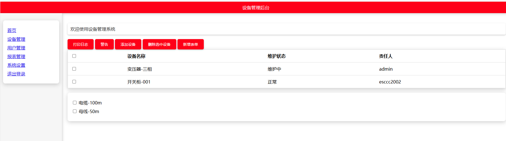

# dictToHtml

## 项目介绍

dictToHtml是一个Python工具，用于将Python字典转换为功能基本的单HTML页面。它提供了一种简单直观的方式来通过字典配置生成包含各种UI组件和基本交互功能的网页。

### 安装
```bash
pip install dicttohtml
```

### 主要特性

- 支持自定义页面标题和页眉
- 灵活的页面布局配置（页眉、侧边栏等）
- 自定义样式设置（颜色、字体等）
- 丰富的UI组件支持：
  - 段落文本
  - 按钮
  - 表格（可编辑）
  - 列表（可编辑）
  - 表单
  - 侧边栏导航
- 内置JavaScript事件处理
- 组件ID前缀自定义，方便DOM操作

## 参数说明

### 页面配置参数 (page_dict)

```python
page_dict = {
    "title": str,          # 页面标题
    "header": str,         # 页面头部内容
    "sidebar": list,       # 侧边栏菜单项列表
    "content": list,       # 页面主要内容元素列表
    "scripts": list,       # JavaScript脚本列表
    "style": {            # 样式配置
        "colors": {       # 自定义颜色
            "primary": str,     # 主色，默认: #3498db
            "secondary": str,   # 次色/悬停色，默认: #2980b9
            "background": str,  # 背景色，默认: #f5f6f5
            "text": str,        # 文本色，默认: #333333
            "border": str,      # 边框色，默认: #ddd
            "shadow": str       # 阴影色，默认: rgba(0, 0, 0, 0.2)
        }
    },
    "layout": {           # 布局配置
        "show_header": bool,   # 是否显示头部，默认: True
        "show_sidebar": bool   # 是否显示侧边栏，默认: True
    }
}
```
### 元素配置参数
每个元素都需要指定以下基本参数

```python
element = {
    "type": str,          # 元素类型（必需）
    "prefix": str,        # 元素前缀，用于生成ID和样式（必需）
    "editable": bool,     # 是否可编辑（可选，默认False）
    "children": list      # 子元素列表（可选）
}
```
列表 (list)
```python
{
    "type": "list",
    "prefix": str,
    "items": list,        # 列表项
    "editable": bool      # 是否可编辑
}
```
表格 (table)
```python
{
    "type": "table",
    "prefix": str,
    "headers": list,      # 表头列表
    "data": list,         # 数据行列表
    "editable": bool      # 是否可编辑
}
```
表单 (form)
```python
{
    "type": "form",
    "prefix": str,
    "action": str,        # 表单提交地址
    "fields": list        # 表单字段列表
}
```
按钮 (button)
```python
{
    "type": "button",
    "prefix": str,
    "text": str,          # 按钮文本
    "action": str,        # 点击事件处理函数名
}
```
其他元素
- 段落 (paragraph)
- 图片 (image)
- 链接 (link)
- 分割线 (hr)
- 标题 (h1-h6)
- 引用 (blockquote)
- 代码块 (code)

## 使用示例

以下示例展示了如何使用dictToHtml创建一个设备管理后台页面：

```python
from dictToHtml import HtmlGenerator

# 页面配置字典
page_dict = {
    'title': '设备管理后台',
    'header': '设备管理后台',
    # 自定义样式
    'style': {
        'colors': {
            'primary': 'red'  # 覆盖默认主色调
        },
        'font_family': 'Arial, sans-serif',
    },
    # 页面布局配置
    'layout': {
        'show_header': True,
        'show_sidebar': True
    },
    # 侧边栏导航配置
    'sidebar': [
        {'text': '首页', 'href': '#'},
        {'text': '设备管理', 'href': '#'},
        {'text': '用户管理', 'href': '#'},
        {'text': '报表管理', 'href': '#'},
        {'text': '系统设置', 'href': '#'},
        {'text': '退出登录', 'href': '#'}
    ],
    # 页面内容配置
    'content': [
        # 欢迎文本
        {'type': 'paragraph', 'text': '欢迎使用设备管理系统', 'prefix': 'welcome'},
        
        # 功能按钮
        {'type': 'button', 'text': '打印日志', 'action': 'printLog', 'prefix': 'log'},
        {'type': 'button', 'text': '警告', 'action': 'showAlert', 'prefix': 'alert'},
        {'type': 'button', 'text': '添加设备', 'action': 'addRow', 'prefix': 'add'},
        {'type': 'button', 'text': '删除选中设备', 'action': 'deleteRows', 'prefix': 'delete'},
        {'type': 'button', 'text': '新增表单', 'action': 'showForm', 'prefix': 'form-btn'},
        
        # 可编辑表格
        {'type': 'table', 
         'editable': True, 
         'headers': ['设备名称', '维护状态', '责任人'],
         'data': [
             ['变压器-三相', '维护中', 'admin'], 
             ['开关柜-001', '正常', 'esccc2002']
         ], 
         'prefix': 'device'},
        
        # 可编辑列表
        {'type': 'list', 
         'editable': True, 
         'items': ['电缆-100m', '母线-50m'], 
         'prefix': 'cable'},
        
        # 表单配置
        {'type': 'form', 
         'action': '/submit', 
         'fields': [
            {'label': '设备名称:', 'type': 'text', 'name': 'equip_name', 'placeholder': '请输入设备名称'},
            {'label': '状态:', 'type': 'text', 'name': 'status', 'placeholder': '请输入状态'},
            {'label': '责任人:', 'type': 'text', 'name': 'person', 'placeholder': '请输入责任人'}
         ], 
         'prefix': 'device-form'}
    ],
    # JavaScript交互脚本
    'scripts': [
        # 全选功能
        """
        document.getElementById('device-select-all').addEventListener('change', function() {
          let checkboxes = document.querySelectorAll('#device-body input[type="checkbox"]');
          checkboxes.forEach(cb => cb.checked = this.checked);
        });
        """,
        # 添加设备行
        """
        function addRow() {
          let tbody = document.getElementById('device-body');
          let rowCount = tbody.children.length;
          let newRow = document.createElement('tr');
          newRow.id = 'device-row-' + rowCount;
          newRow.className = 'device-row';
          newRow.innerHTML = `
            <td id="device-td-${rowCount}-select" class="device-td"><input type="checkbox" name="device-row-${rowCount}"></td>
            <td id="device-td-${rowCount}-new-device" class="device-td" contenteditable="true">新设备-${rowCount}</td>
            <td id="device-td-${rowCount}-maintenance" class="device-td" contenteditable="true">维护中</td>
            <td id="device-td-${rowCount}-admin" class="device-td" contenteditable="true">admin</td>
          `;
          tbody.appendChild(newRow);
        }
        """,
        # 删除选中行
        """
        function deleteRows() {
          let tbody = document.getElementById('device-body');
          let checkboxes = tbody.querySelectorAll('input[type="checkbox"]:checked');
          checkboxes.forEach(cb => cb.parentElement.parentElement.remove());
        }
        """,
        # 显示表单
        """
        function showForm() {
          let form = document.getElementById('device-form-form');
          form.style.display = 'block';
        }
        """,
        # 保存表单数据
        """
        function saveDeviceForm() {
          let form = document.getElementById('device-form-form');
          let inputs = form.querySelectorAll('input[type="text"]');
          let data = Array.from(inputs).map(input => input.value).join(', ');
          let ul = document.getElementById('cable-list');
          let li = document.createElement('li');
          li.id = 'cable-item-' + ul.children.length;
          li.className = 'cable-item';
          li.innerHTML = `<input type="checkbox" name="cable-item-${ul.children.length}"> <span contenteditable="true">${data}</span>`;
          ul.appendChild(li);
          form.style.display = 'none';
        }
        """,
        # 警告提示
        """
        function showAlert() {
          alert('警告！');
        }
        """,
        # 打印日志
        """
        function printLog() {
          console.log('日志已打印');
        }
        """
    ]
}

# 生成HTML
html_code = HtmlGenerator(page_dict).generate_html()
with open('output.html', 'w', encoding='utf-8') as f:
    f.write(html_code)
print("HTML 已生成并保存到 output.html")
```
## 运行结果
运行上述示例代码后，将生成一个名为output.html的HTML文件。打开该文件，你将看到一个包含设备管理相关信息的页面。


这个示例展示了如何：

1. 配置页面基本信息（标题、页眉）
2. 自定义样式（颜色、字体）
3. 设置页面布局（显示页眉和侧边栏）
4. 配置侧边栏导航菜单
5. 添加各种UI组件：
   - 文本段落
   - 功能按钮
   - 可编辑表格
   - 可编辑列表
   - 表单
6. 实现交互功能：
   - 表格行的添加和删除
   - 表单的显示和数据处理
   - 简单的警告和日志打印

生成的HTML页面将包含所有配置的组件和功能，可以直接在浏览器中运行。